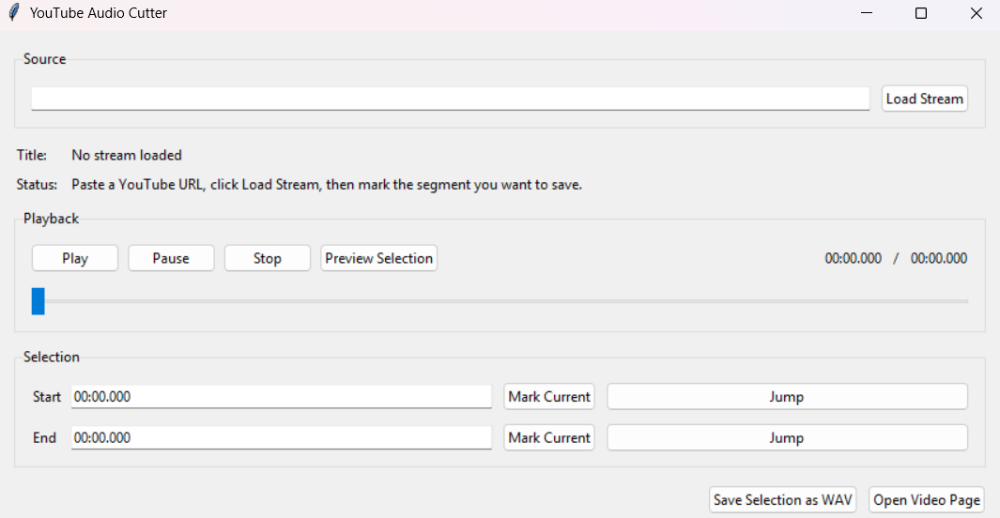

# YouTube Audio Cutter

Windows desktop app for streaming YouTube audio, choosing the exact section you want, and exporting that selection as a WAV file.
Useful for TTS apps like PocketTTS.

## Features

- Stream audio directly from a YouTube video URL
- Play, pause, seek, and preview inside a simple desktop GUI
- Mark `start` and `end` points for the clip you want
- Export only the selected segment to `.wav`

## Requirements

- Windows 10 or Windows 11
- VLC installed on the same machine
- Internet connection

## Getting Started

1. Make sure VLC is installed
2. Run `YouTubeAudioCutter.exe`
3. Paste a YouTube video URL
4. Click `Load Stream`
5. Mark the section you want
6. Click `Save Selection as WAV`

## Install VLC

This app uses your local VLC installation for playback.

If VLC is not already installed:

1. Download VLC from [videolan.org](https://www.videolan.org/vlc/)
2. Install it normally
3. Start `YouTubeAudioCutter.exe`

If VLC is installed in a custom folder, set the `VLC_DIR` environment variable to the folder that contains `libvlc.dll`.

## How It Works

- The app resolves a playable YouTube audio stream
- Playback happens through VLC
- The selected range is exported to WAV with FFmpeg
- It does not need to download a full video file to disk first

## Output

- Format: WAV
- Audio codec: PCM 16-bit
- Sample rate: 44.1 kHz
- Channels: Stereo

## Troubleshooting

### VLC not found

Install VLC first. If it is already installed in a non-standard location, set `VLC_DIR` to your VLC folder and start the app again.

### Windows shows a SmartScreen warning

This release is not code-signed. If Windows shows a warning, click `More info` and then `Run anyway` if you trust the file.

### A URL does not load

That usually means YouTube changed something, the video is unavailable, or the stream is region/age restricted. Updating to a newer release should usually fix extractor issues.

## Notes

- This version exports one selected segment at a time
- The app is focused on audio clipping, not full video downloading or editing
